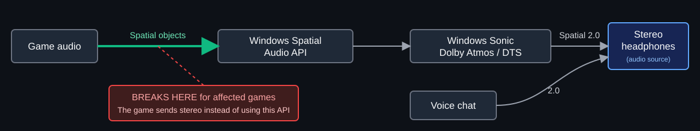
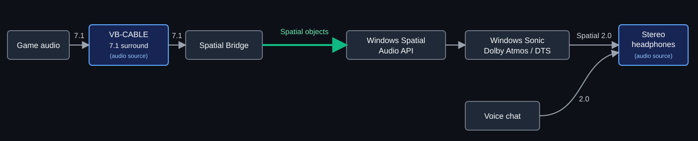
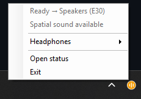
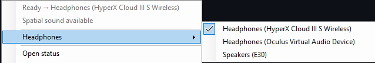
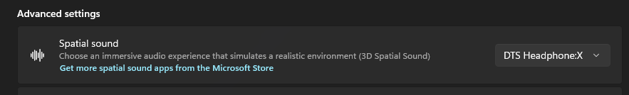
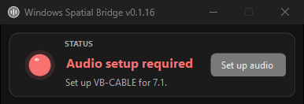
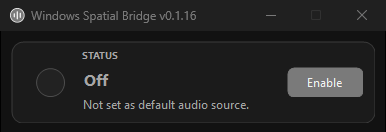
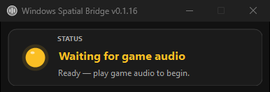
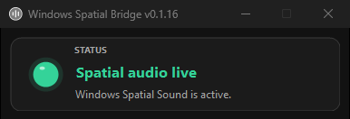

# Windows Spatial Bridge

**Spatial headphone audio for games that support 7.1 but do not use Windows
Spatial Sound correctly.**

Built for **Destiny 2**. Also confirmed working with **Helldivers 2** and
**Jump Space**.

## What does it do?

Some games see normal headphones as stereo and never send their 7.1 mix to
Windows Spatial Sound. The bridge gives the game a virtual 7.1 output and sends
those separate channels to Windows Sonic, Dolby Atmos for Headphones, or DTS
Headphone:X.

### How Windows Spatial Audio should work — and where it fails

Games with native Windows spatial support send spatial audio directly to
Windows. They do not need the bridge.

Blue boxes in both diagrams are normal Windows audio sources/devices. The other
boxes process or render the audio. The red box and dashed link show where
affected games fail; green shows the bridge successfully completing the same
Spatial Audio handoff.

### How Windows Spatial Bridge fixes it

Windows Spatial Bridge preserves the game's eight-channel mix and feeds it to
Windows Spatial Sound:

Windows turns the 7.1 mix into spatial audio for your stereo headphones.

> [!IMPORTANT]
> It does **not** modify game files, inject code, hook the game, read game
> memory, or interact with anti-cheat.

### Voice chat stays normal

Choose your real headphones inside Discord or the game's voice-chat settings.
Voice chat then goes straight to the normal stereo headphones while game audio
uses the 7.1 bridge.

## Setup

### 1. Install VB-CABLE

[Download the official VB-CABLE Driver Pack](https://vb-audio.com/Cable/),
install it, and restart Windows if asked. You do not need to rename its audio
devices.

### 2. Install Windows Spatial Bridge

[Download and run the latest MSI](https://github.com/mrbeag/windows-spatial-bridge/releases/latest).
Windows may say **Unknown publisher** because the app is not code-signed.

When installation finishes, Windows Spatial Bridge starts beside the clock.
Click the **^** arrow if its round icon is hidden, then right-click the icon to
open its menu.

### 3. Choose your real headphones

Right-click the bridge icon beside the clock. Open **Headphones** and select the
headphones or DAC you actually listen through.

### 4. Turn on Spatial Sound for your headphones

Open **Windows Settings → System → Sound** and select the same physical
headphones you chose in step 3. Under **Spatial sound**, choose Windows Sonic,
Dolby Atmos for Headphones, or DTS Headphone:X.

> [!IMPORTANT]
> Enable Spatial Sound on your **physical headphones**, never on a VB-CABLE
> device.

### 5. Finish audio setup

**Audio setup required:** Click **Set up audio** and approve the Windows prompt.
The app will set VB-CABLE to **8 channels, 24-bit, 48 kHz** so games can output
a conventional 7.1 mix. You can also select that format manually in the
VB-CABLE device properties if you prefer.

**Off:** Click **Enable** to make VB-CABLE the Windows default audio output.

**Waiting for game audio:** Start or restart your game.

**Spatial audio live:** Setup is complete; game audio is flowing through
Windows Spatial Sound.

## Tested games

- Destiny 2
- Helldivers 2
- Jump Space

## Games with native spatial audio

If a game already has working native Windows Spatial Audio, set your physical
headphones as the Windows default audio output or select them as the output
inside the game. Either option bypasses the bridge for that game.

## More information

- [Technical details, latency, and channel mapping](docs/TECHNICAL.md)
- [Changelog](CHANGELOG.md)
- [Apache 2.0 license](LICENSE)
